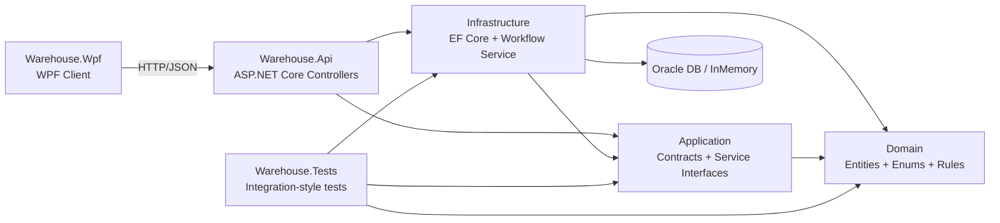

# Warehouse Order Dashboard (.NET 8)

A production-style sample solution that demonstrates a complete warehouse order lifecycle across API, database, and desktop UI layers.

It is designed to be readable for **HR reviewers**, **solution architects**, and **senior engineers**:
- clear layered architecture
- explicit contracts between layers
- realistic workflow rules (reservation, picking, shipping)
- Oracle + EF Core integration
- automated integration-style tests

---

## Quick Start (2 minutes)

1. Open the solution in Visual Studio.
2. Ensure API uses in-memory DB for the fastest run:
   - set `ConnectionStrings:Oracle` to empty in `Api/appsettings.Development.json`.
3. Set startup projects to run both:
   - `Warehouse.Api`
   - `Warehouse.Wpf`
4. Press `F5`.
5. Verify:
   - API Swagger: `https://localhost:58291/swagger`
   - WPF app loads Orders/Stock/Picking Tasks tabs.

---

## 1) Solution Overview

`WarehouseOrderDashboard` is a **layered monolith** built with **Clean Architecture principles**:
- domain logic isolated in the domain/application layers
- infrastructure concerns (EF Core, Oracle) isolated in infrastructure
- delivery mechanisms separated into Web API and WPF client

The solution supports:
- order creation and status transitions
- stock reservation and shortage detection
- picking task generation and line completion
- dashboard metrics
- paged data browsing in WPF (`Orders`, `Stock`, `Picking Tasks`)

---

## 2) Architecture Style

### Architectural style
- **Layered / Clean Architecture-inspired** design
- **Domain-centric modeling** with entities and enums in `Domain`
- **Application contracts** (DTOs, requests, paged responses, service interfaces)
- **Infrastructure implementation** for persistence and workflow orchestration
- **Presentation adapters**:
  - `Api` (REST + Swagger)
  - `Warehouse.Wpf` (desktop operator console)

### Dependency direction
Dependencies flow inward:
- `Api` -> `Application`, `Infrastructure`
- `Warehouse.Wpf` -> API over HTTP only
- `Infrastructure` -> `Application`, `Domain`
- `Application` -> `Domain`
- `Domain` -> no internal project dependencies
- `Tests` -> `Application`, `Infrastructure`, `Domain`

This keeps business rules independent from UI and transport concerns.

### Architecture Diagram



---

## 3) Project Structure

| Project | Responsibility | Key Contents |
|---|---|---|
| `Domain` | Core business model | `WarehouseOrder`, `OrderLine`, `StockBalance`, `PickingTask`, statuses, base entity with audit/version fields |
| `Application` | Use-case contracts | Service interfaces, DTOs, request models, `PagedResult<T>` |
| `Infrastructure` | Data access + workflow implementation | `AppDbContext`, EF mappings, `OrderWorkflowService`, Oracle SQL scripts |
| `Api` | HTTP entry point | Controllers for Orders, Stock, Picking Tasks, Dashboard; Swagger; DI and DB provider setup |
| `Warehouse.Wpf` | Desktop operator UI | Tabs for Orders/Stock/Picking Tasks/Dashboard, paging commands, API client |
| `Tests` | Automated test coverage | xUnit integration-style tests over in-memory EF Core DB |

---

## 4) Technical Stack

### Platform
- **.NET 8**
- C# 12
- Visual Studio Community 2026 (compatible)

### Backend
- **ASP.NET Core Web API**
- **Entity Framework Core 8.0.11**
- **Oracle EF Core provider 8.23.80** (`Oracle.EntityFrameworkCore`)
- Optional **EF InMemory** provider for local/demo runs
- **Swagger/OpenAPI** via `Swashbuckle.AspNetCore 6.6.2`

### Desktop
- **WPF** (`net8.0-windows`)
- MVVM-style view model + command pattern (`AsyncRelayCommand`)
- `HttpClient` + `System.Net.Http.Json`

### Testing
- **xUnit 2.9.2**
- `Microsoft.NET.Test.Sdk 17.11.1`
- `xunit.runner.visualstudio 2.8.2`
- `coverlet.collector 6.0.2`
- EF Core InMemory for isolated integration-style tests

---

## 5) Core Patterns and Practices

- **Dependency Injection** across API services
- **Repository-like behavior via `DbContext` + LINQ queries**
- **DTO boundary pattern** between transport and domain entities
- **Optimistic concurrency** (`Version` field as concurrency token)
- **Audit metadata** (`CreatedAt`, `UpdatedAt`) handled centrally in `SaveChangesAsync`
- **Problem Details** responses for operational/domain errors
- **Paging contract standardization** using `PagedResult<T>`
- **Oracle compatibility handling** (e.g., boolean projection adapted in stock queries)

---

## 6) Data Model (High-Level)

Main aggregates/entities:
- `Customer`
- `WarehouseLocation`
- `Item`
- `WarehouseOrder` (+ `OrderLine`)
- `StockBalance`
- `StockReservation`
- `PickingTask` (+ `PickingTaskLine`)
- `AuditLog`

Key rules reflected in service logic:
- order status transition validation
- reservation based on available minus reserved stock
- picking task creation only from pickable statuses
- picked quantities decrement reserved/available stock

---

## 7) API Surface (Summary)

### Orders
- `POST /api/orders`
- `GET /api/orders` (paged + filters)
- `GET /api/orders/{orderId}`
- `PATCH /api/orders/{orderId}/status`
- `POST /api/orders/{orderId}/cancel`

### Stock
- `GET /api/stock` (paged, optional `warehouseId`)

### Picking Tasks
- `GET /api/picking-tasks` (paged, `activeOnly` flag)
- `POST /api/picking-tasks`
- `PATCH /api/picking-tasks/lines/{lineId}/complete`

### Dashboard
- `GET /api/dashboard/today`

Swagger runs with API and is available at:
- `https://localhost:58291/swagger`

---

## 8) Local Startup Guide (Visual Studio, step-by-step)

### Prerequisites
1. Visual Studio 2022/2026 with:
   - .NET desktop development
   - ASP.NET and web development
2. .NET 8 SDK
3. Optional Oracle Database (if running relational mode)

### Option A: Quick local run (no Oracle, InMemory DB)
Recommended for first run.

1. Open solution in Visual Studio.
2. Configure API to use in-memory provider:
   - set `ConnectionStrings:Oracle` to empty in `Api/appsettings.Development.json`, for example:
   ```json
   {
     "ConnectionStrings": {
       "Oracle": ""
     }
   }
   ```
3. Right-click solution -> `Set Startup Projects...`.
4. Select `Multiple startup projects`.
5. Set `Warehouse.Api` = Start, `Warehouse.Wpf` = Start.
6. Run (`F5`).
7. Verify API/Swagger:
   - `https://localhost:58291/swagger`
8. WPF app opens and consumes API locally.

### Option B: Oracle local run
Use this when validating Oracle-specific behavior and SQL scripts.

1. Provision local Oracle service (for example XE/PDB setup).
2. Create and use a dedicated schema user.
3. Execute schema script:
   - `Infrastructure/Sql/oracle_schema.sql`
4. (Optional) Load rich sample data:
   - `Infrastructure/Sql/oracle_sample_data.sql`
5. Set valid Oracle connection string in API config (`ConnectionStrings:Oracle`).
6. Set startup projects (`Warehouse.Api`, `Warehouse.Wpf`) and run.
7. Confirm API reachable via Swagger and WPF grid data loads.

---

## 9) WPF Features (Operator Console)

Tabs:
- `Orders`
- `Stock`
- `Picking Tasks`
- `Dashboard`

Implemented UX capabilities:
- async refresh per area
- create picking task from selected orders
- API error message surfacing (domain messages vs generic connectivity)
- paging in all list grids with **25 items/page**

### Screenshots

> Add UI screenshots to `docs/screenshots/` and keep links below updated.

- `Orders` tab (paged grid): `docs/screenshots/orders-tab.png`
- `Stock` tab (paged grid): `docs/screenshots/stock-tab.png`
- `Picking Tasks` tab (paged grid): `docs/screenshots/picking-tasks-tab.png`
- `Dashboard` tab (KPI view): `docs/screenshots/dashboard-tab.png`
- Swagger API overview: `docs/screenshots/swagger.png`

---

## 10) Tests: Scope and How to Run

Test project: `Tests/Warehouse.Tests.csproj`

Current automated tests are integration-style service tests over EF InMemory:
- `ConfirmOrder_ReservesStock_AndSetsReservedStatus`
- `CancelShippedOrder_Throws`
- `CreatePickingTask_AndCompleteLine_UpdatesTaskProgress`
- `CreatePickingTask_MixedPickableAndNonPickable_SkipsNonPickableOrder`
- `CreatePickingTask_OnlyNonPickableOrders_ThrowsWithReason`
- `GetOrdersAsync_ReturnsPagedResult`
- `GetStockOverviewAsync_ReturnsPagedResult_WithShortageFlag`
- `GetPickingTasksAsync_FiltersActive_AndPages`

### What is validated
- core workflow correctness (reservation, status transitions, picking completion)
- business-rule enforcement on invalid transitions
- mixed/non-pickable order handling during task creation
- paging behavior and counts for orders/stock/picking tasks
- shortage projection behavior in stock results

### Run tests in Visual Studio
1. Build solution.
2. Open `Test` -> `Test Explorer`.
3. Run all tests in `Warehouse.Tests`.

### Run tests from terminal
From solution root:
```powershell
dotnet test Tests/Warehouse.Tests.csproj
```

With coverage collector:
```powershell
dotnet test Tests/Warehouse.Tests.csproj --collect:"XPlat Code Coverage"
```

---

## 11) Why this repository is strong for portfolio review

For HR:
- demonstrates full-stack .NET delivery (API + desktop + tests)
- production-minded error handling and observability defaults

For architects:
- clear separation of concerns and dependency boundaries
- explicit contracts and stable paging envelope
- Oracle + in-memory dual-mode runtime strategy

For senior developers:
- realistic workflow state transitions
- consistent async code paths
- pragmatic automated coverage of critical behaviors and regressions

---

## 12) Future Enhancements (roadmap ideas)

- authentication/authorization and role-based workflows
- true migration pipeline (EF migrations + CI/CD database promotion)
- richer domain events and outbox pattern
- containerized local environment (API + Oracle + UI test harness)
- structured logging/tracing (`OpenTelemetry`)
- expanded API/integration test suite with HTTP-level tests
